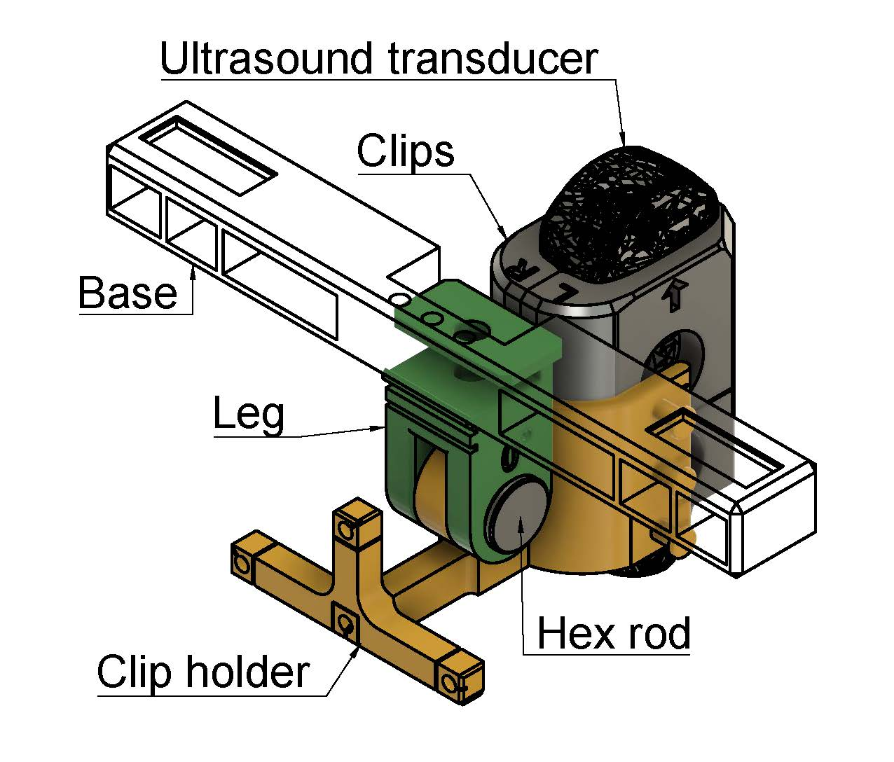
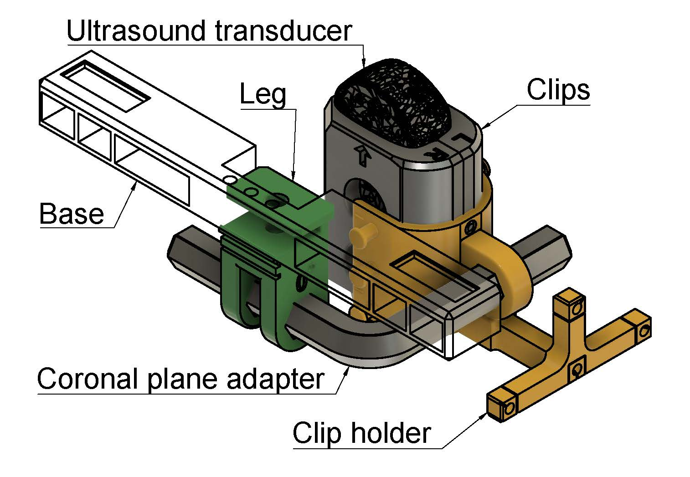

# ALPHUS: Adjustable Laboratory Probe Holder for UltraSound
Open platform for 3D-printed ultrasound probe stabilizer.
#### The current design can fit both adult and young children.
#### The orientation can be transformed between mid-sagittal plane and coronal plane (90 degree perpendicular to sagittal plane) by switching from 'rod_hex' to 'rod_L-shape'.
- The ‘print_list.txt’ specifies how many pieces you need for each component. 
- In the ‘clips’ folder, only print the one pair (left and right halves) that matches your ultrasound probe.

#### To cite ALPHUS:
Chen, W.-R., Stern, M. C., Whalen, D. H., Derrick, D., Carignan, C., Best, C. T., & Tiede, M. (2024). Assessing ultrasound probe stabilization for quantifying speech production contrasts using the Adjustable Laboratory Probe Holder for UltraSound (ALPHUS). Journal of Phonetics, 105, 101339. https://doi.org/10.1016/j.wocn.2024.101339 

  

  
  

  

### Assembly video:

https://github.com/WeirongChen/Open_Ultrasound_Probe_Stabilizer/assets/25228432/d91f93db-fce2-4633-afd8-40785a352450

## Configurations
###  for sagittal tongue imaging:

### for coronal tongue imaging:

<!-- https://github.com/WeirongChen/Open_Ultrasound_Probe_Stabilizer/blob/main/figs/MM01_dissemble.mp4 -->

COPYRIGHT, LICENSE & DISCLAIMER
Copyright (C) 2020 Wei-Rong Chen <wei-rong.chen[AT]yale.edu>  
This program is free software under GNU General Public License, version 3.  
This program is distributed WITHOUT ANY FORM of EXPRESS or IMPLIED WARRANTY and ANY SUPPORT.    
See the GNU General Public License for more details.  
